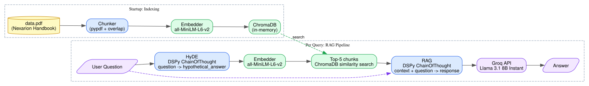

# Nexarion Sports Complex — RAG Chatbot

## Source Document

The knowledge base is a fictional handbook for **Nexarion Sports Complex**, a made-up multi-sport facility in Thornvale, Wyoming. It covers 12 facility zones, membership tiers and fees, operating hours, rules and policies, staff contacts, and parking.

---

## What this app does

A **Retrieval-Augmented Generation (RAG)** chatbot that answers questions grounded in that document — no hallucination of facts outside the source material.

## How it works

1. **Ingestion** — The PDF is parsed with `pypdf` and split into overlapping 300-word chunks (50-word overlap) so table headers stay attached to their rows across chunk boundaries.
2. **Indexing** — Each chunk is embedded with `all-MiniLM-L6-v2` (a 22M-parameter sentence-transformer model from HuggingFace) and stored in an in-memory **ChromaDB** vector database.
3. **HyDE retrieval** — When a question arrives, a language model first generates a *hypothetical answer*. That answer is embedded and used as the search query instead of the raw question — this technique (Hypothetical Document Embeddings) significantly improves retrieval of sparse content like table rows.
4. **Generation** — The top-5 retrieved chunks are passed as context to the LLM with a strict instruction: answer using only the provided context, or admit it doesn't know.

The entire pipeline — HyDE, retrieval, and generation — is composed using **DSPy** (Stanford), a framework that replaces hand-written prompt strings with typed, declarative modules (`dspy.Signature`, `dspy.ChainOfThought`). This makes the pipeline modular, testable, and optimizable without touching raw prompts.

## Architecture



## Stack

| Layer | Technology |
|---|---|
| LLM | Llama 3.1 8B via **Groq** API |
| RAG framework | **DSPy** (Stanford) |
| Vector store | **ChromaDB** (in-memory) |
| Embeddings | **HuggingFace** `all-MiniLM-L6-v2` |
| PDF parsing | `pypdf` |
| UI | **Streamlit** |

## Setup

```bash
pipenv install
```

Add your Groq API key to `.env`:

```
GROQ_API_KEY=your_key_here
```

Then run:

```bash
pipenv run streamlit run app.py
```
